# Week 8 - 10/12

Our team continued to ideate! I got a proximity / gesture sensor working, and set up a simple publish to the particle.io console.

# Week 7 - 10/05
Our team ideated on a [figjam board](https://www.figma.com/file/21NAt97JnzujQQBOlBk4dq/Music-Collab?type=whiteboard&node-id=0%3A1&t=sAtFPmvNcsmlZ8aG-1). Password: teenage-designing 

Tangential & outside of class, but I got a Spot to move over the weekend at the AI in motion hackathon in SF!

# Week 6 - 9/28

9/28 - Set up OLED display with Photon 2 via Adafruit OLED guide and Photon 2 pinout. Using I2C. Thanks to Jeff and Sudhu for the I2C cable!
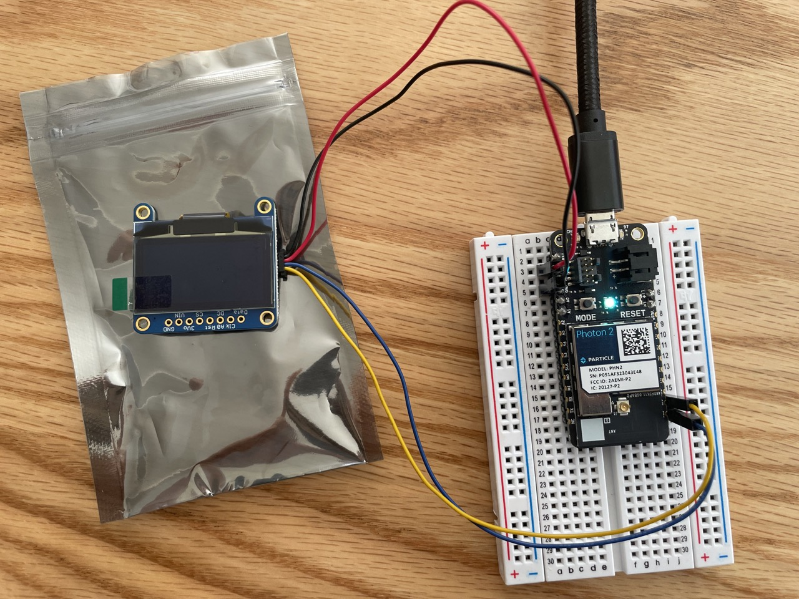

Installed Adafruit SSD1306 library for Particle in VS Code - went to particle's firmware libraries page, and installed _Adafruit_SSD1306_RK_, as that seems to be the newest library and maintained directly by Adafruit.

Couldn't find the example code for the OLED in VS code, so downloaded and installed the same libraries on the Arduino IDE. Arduino examples did not compile when copied to Particle - main error was using _SSD_1306_WHITE_ (or a different color) for drawing on the OLED.

Went back to Particle's firmware libraries page and found that examples should be in file structure of particle libraries, and from VS code error paths, found where the library examples are (in the lib folder in the project folder). Particle libraries apparently use _WHITE_ (or color name) for the color instead.

These examples compiled and the OLED worked after a unplug/replug of the Photon 2.
Stopped here for now, too many other things to do this week...

Please ignore the black line down the middle of the OLED, that's just an artifact from the camera, the OLED looks fine IRL.
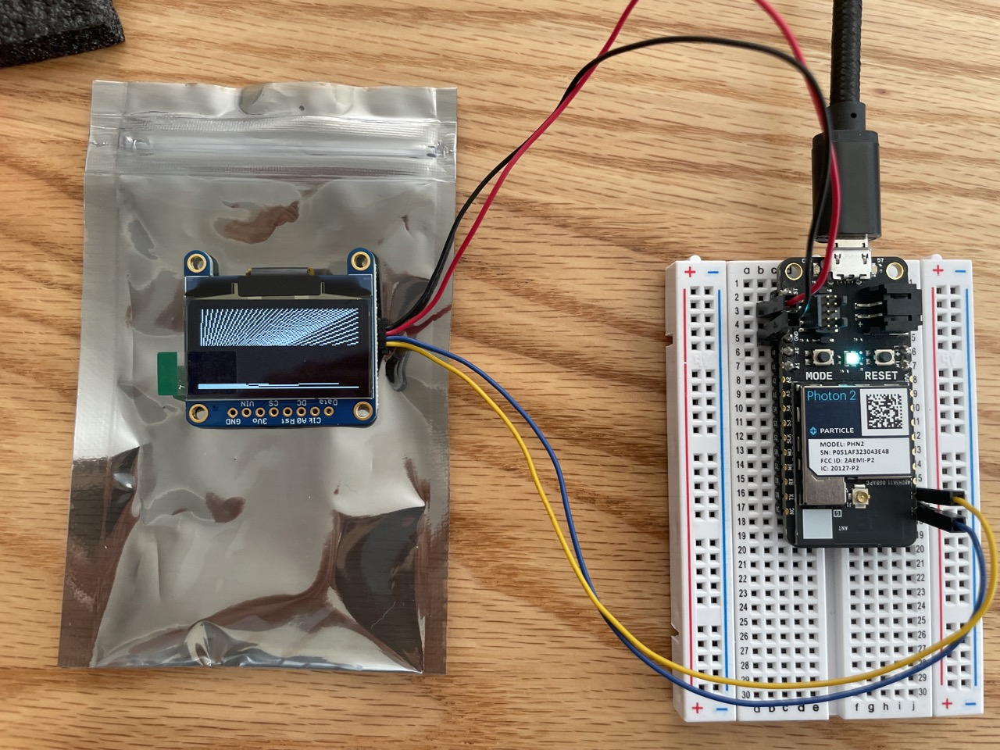

# Week 5 - 9/21

9/20 - Set up photon 2 with Berkeley IoT Wi-Fi. Note to instructors: finding the MAC address of a device is usually easy when on your own network - you can find it in your Wi-Fi router software (e.g. the Eero app).

Testing new commit method from Nova (nova.app).

# Week 4 - 9/14
9/14 - Fabricated a super rough prototype of the concept. I first 3D scanned my hand (using an app on my phone without LiDAR so the quality is not very high), and then built two shapes in grasshopper to conform to either side of my palm, and created an array of needles as a demonstration. I then 3D printed the solid parts and fabricated the soft materials out of scrap fabric at Jacobs.
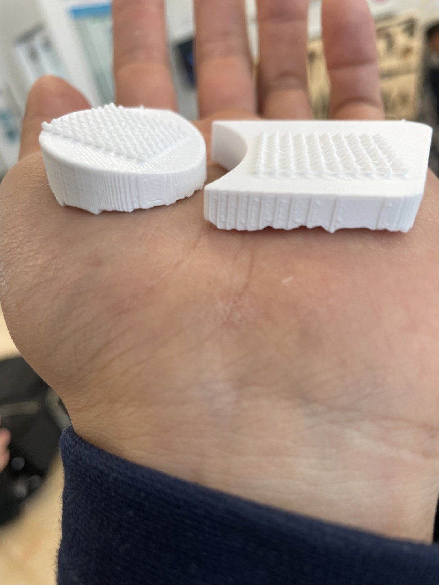
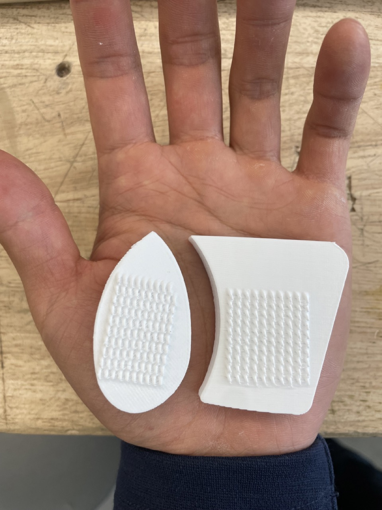
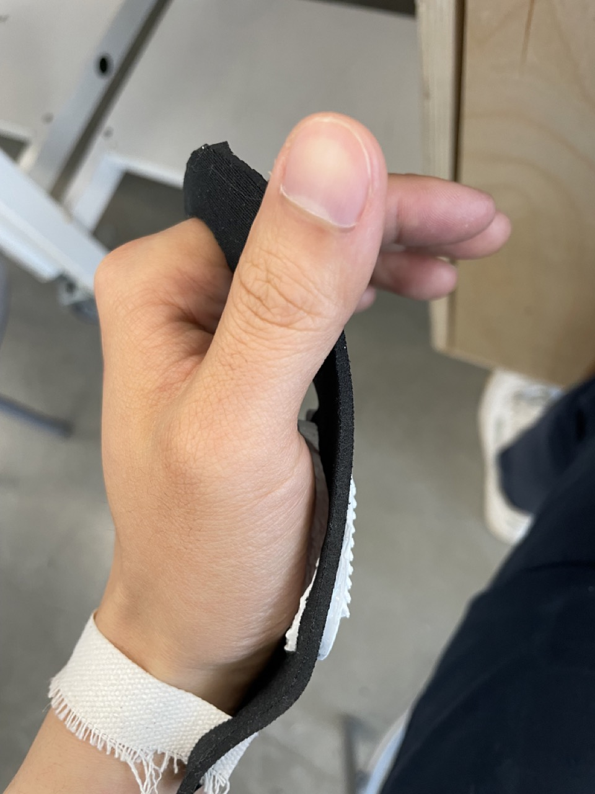
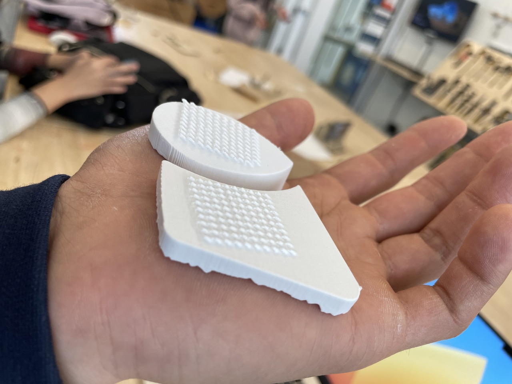

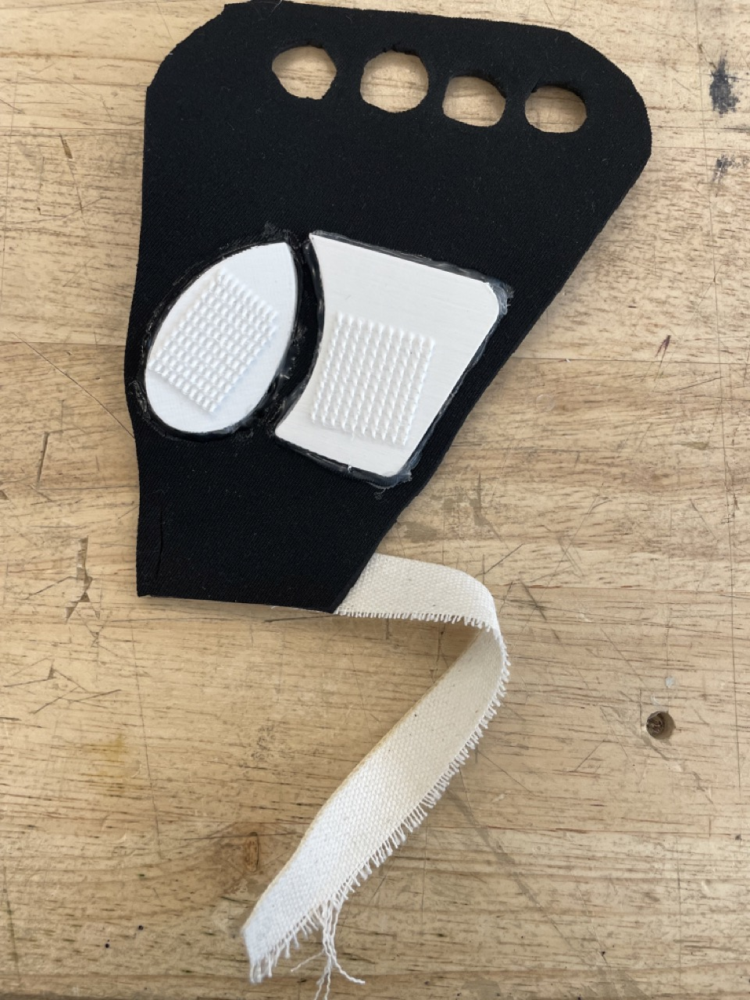
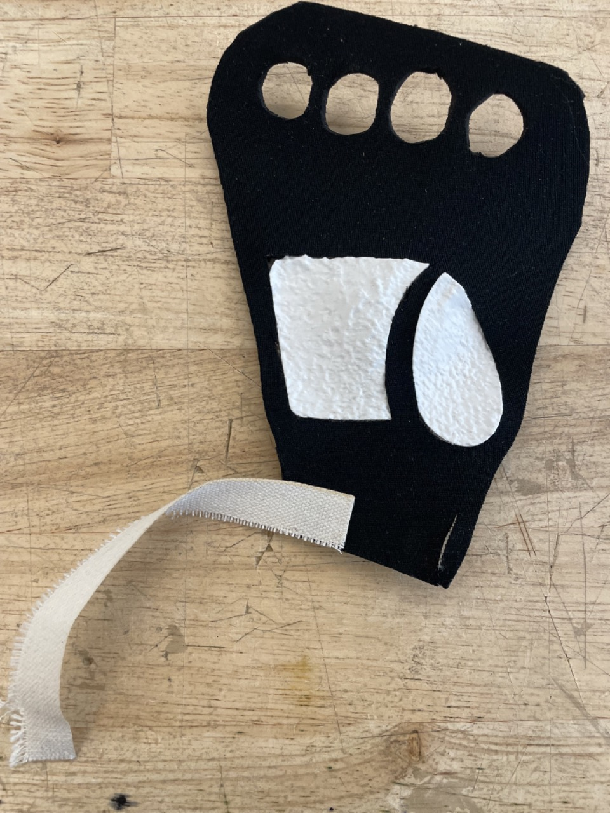
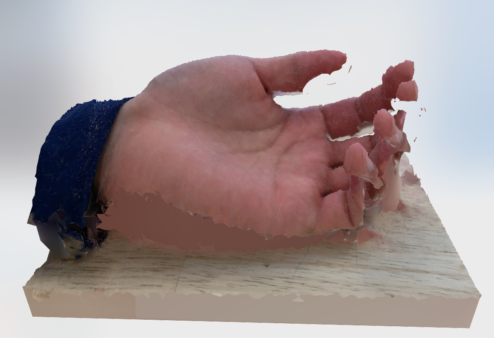
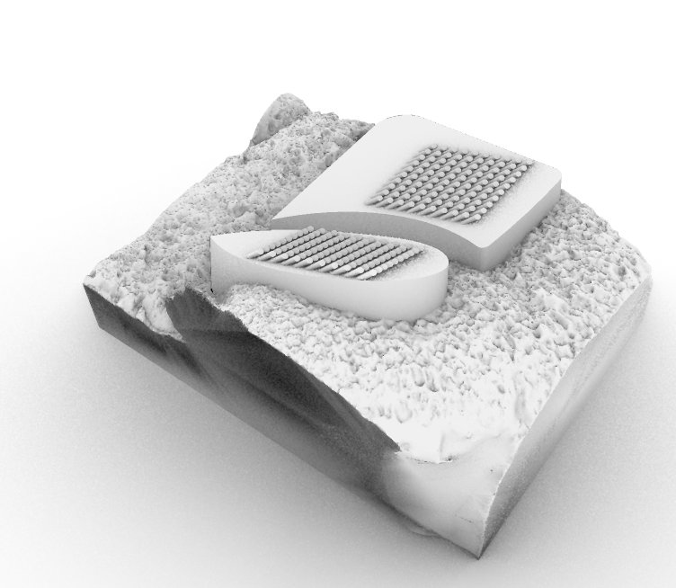
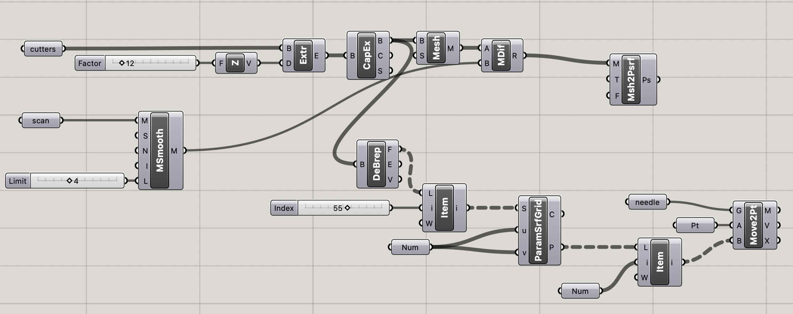

9/13 - Settled on an idea for TDF project 1! Level is probably axolotl but the focus should be more on the concept rather than the specific execution as I only have a day to actually implement this in grasshopper.

Next project I'd like to start thinking about the final deliverable much much earlier, in the beginning, so I have more time to work on the implementation.

The idea is to combine microspine (originally NASA research I afaik) grippers (arrays of needles with springs/flexible backing to grip onto uneven surfaces such as rocks) with a wearable device, to make a climbing glove that can easily stick to rock.
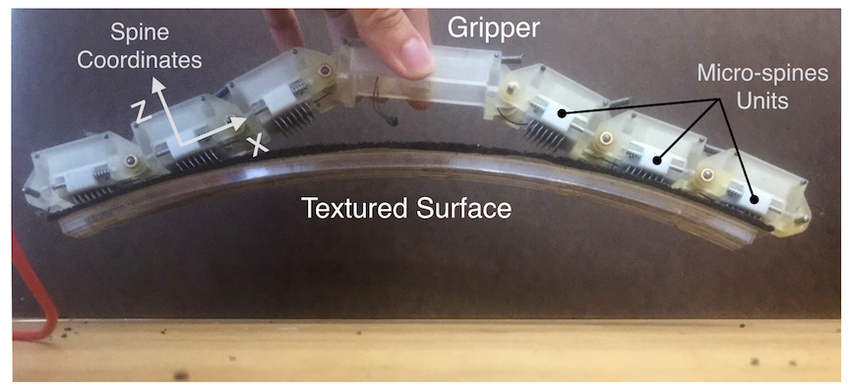

The goal of this design is to create a climbing aid device (likely a pair of gloves). Considerations include the ergonomics of the hand (see sketches below) with three main sections of the palm that bend inwards against each other, ease of wearing/removal, as well as compatibility with common climbing devices (climbing rope, belay devices, harnesses, clothing) which likely necessitates retractable needles to avoid snagging on objects or damage to other, like how cats can retract their claws.
<object data="9-14/handgrippernotes.pdf" type="application/pdf" width="700px" height="700px">
	<embed src="9-14/handgrippernotes.pdf">
		
This browser does not support PDFs. Please click on the link to see the sketches: <a href="9-14/handgrippernotes.pdf">View sketches here</a>.

	</embed>
</object>

# Week 3 - 9/7
9/7 - More ideas for project 1:
1. Business model of selling personalized objects (such as Nike's online shoe customizer, Ray-Ban's sunglasses customizer). Ties into casual creators idea (Kate Compton) from _Debates in Design_. What else is low hanging fruit in that space?
2. Integrating computational design into a game/virtual world by having an ML model understand something about the player/user?
3. A micromobility shoe (with wheels) personalized to the user?
4. Custom - {drone frames, phone cases}

9/6 - I've already "finished" this week's homework, (making a new parametric/computational design with grasshopper) last week, so I want to move forward with project 1 and think about a completely new design I want to do (the bedside table was not enough to be project 1 imo).

I felt the need to go back a few steps and think about my goals for this class, for MDes, and for the future, in order to inform project 1. I don't want to just go into it blindly, without any consideration for how it fits into the bigger picture.

I'll omit my notes about this (they're personal and this is a public repo for now), but here are my current concluding thoughts:

1. For TDF, what I want to get out of it is an exploration of different concepts and ideas that I'm interested in, many of which I wrote in my statement of purpose for MDes:
- embodied/tangible human-AI/robot interaction
- human-respecting technology (calm, respectful of data, attention, time, energy etc)
- a social/political lens (democratization vs. concentration of power)
- systems that enable a better future of technology (business, social, regulatory?)

2. For MDes, I think my optimizations should primarily be within two spaces:
A - PROJECTS - my explorations and the output of those explorations
B - SOCIAL - both in a small "get to know people" sense and in a broad "going to talks, events, office hours, and talking with people to learn how do I begin to go towards these larger, tough goals of mine?" sense

This, importantly, means I need to say no to some other things. The focus should not be on academic research (don't join a lab unless there is good reason), or on tangential work.

Of course, this should be tempered and informed by practical considerations - what to do after MDes? After all, I'm not interested in grand platitudes about how the future should be, but in navigating the world to find where and how I can help. Only a deeply practical and yet also fundamentally hopeful approach is the right way to go.

3. On Project 1, I'm still not sure at all what to do. Here are some very vague thoughts:
- e-ink as a material?
- Galapagos and genetic algorithms in a truly open-ended way?
- something everyone can play or interact with?

I know we're supposed to design for a problem space and some users, (human-centered and all) but we're also not doing proper user research (or maybe I could make that a part)? Where's the balance of something fun and whimsical and probably more internally created vs. something that's made for others entirely?

Researchers may have few degrees of freedom (or at least they should), but designers have a lot. With degrees of freedom comes responsibility.

Just a thought.

# Week 2 - 8/28, 8/31
8/31 - As I'm a little more comfortable with fabrication and have some experience in grasshopper, I made a new design following TJ's process:

I identified a problem: I don't have a bedside table.

I considered the mode of fabrication I was working in: laser cutting. (Or CNC of plywood.)

With these constraints, I had the idea of designing a simple bedside table that would be clamped between my bedframe and mattress.

Here's the concept sketches I came up with:
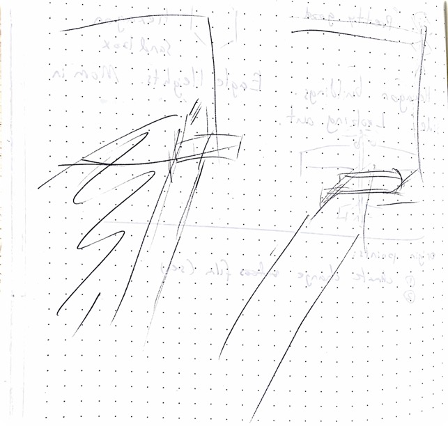

I then realized the concept in Grasshopper:
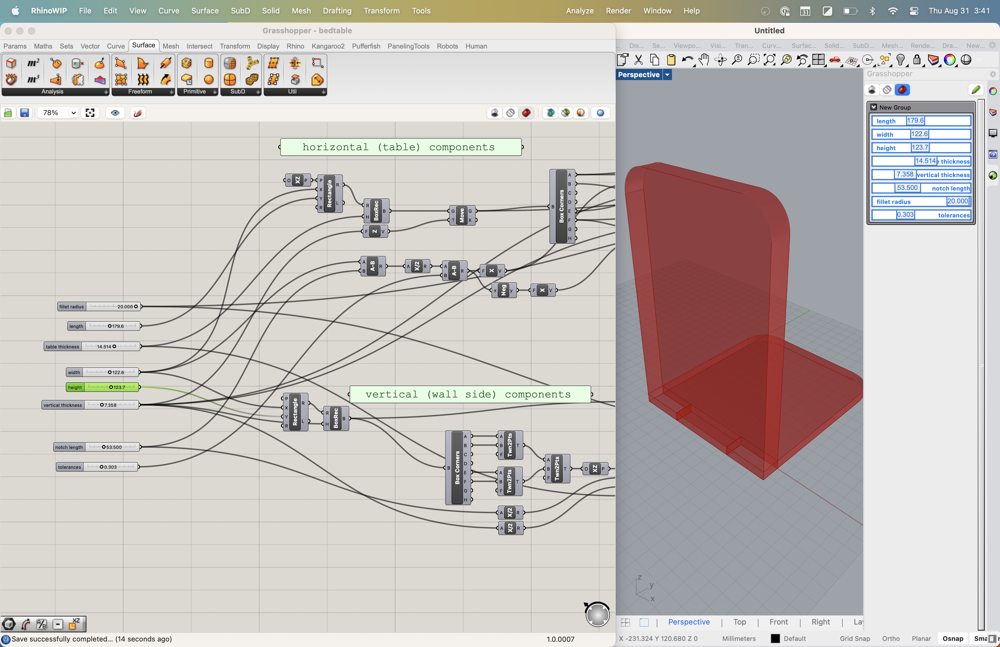
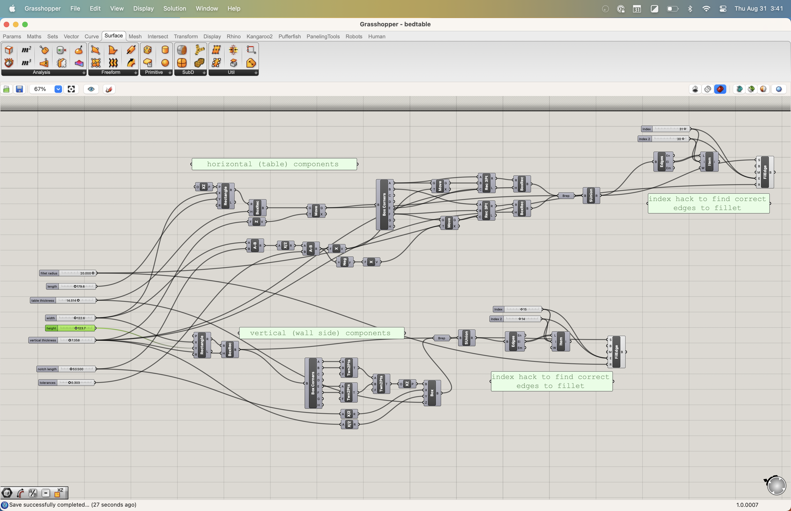

The design allows me to automatically adjust the table width and length, the size and thickness of the material clamped between the bedframe and mattress, and the fillet on the edges.

It took me maybe 2 hours to do it in Grasshopper. It still feels not super useful to do it in GH for such a simple project that could've taken 15 minutes in Rhino, but I can imagine its usefulness if this was for clients with individualized needs.

It's also just more complex to do some basic things in GH (like filleting select edges of a box) than in Rhino. Maybe I'm thinking in "Rhino mode" and I need to think more in terms of Grasshopper tools instead?

Also, I sort of wish the commands in Grasshopper were the same as in Rhino - it annoys me when I can't do _booleanunion_ in grasshopper.

Here's a render:
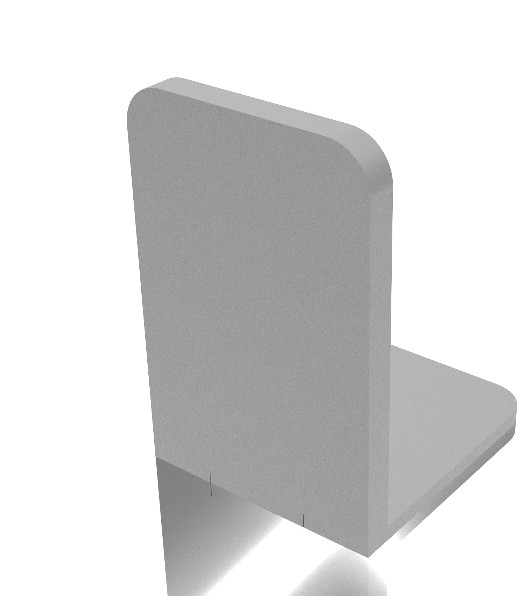

8/28 - Helped a few people with the rhino/GH files. Tried setting up the phone stand model in Rhino 8 WIP, but the phone stand doesn't generate even when all plugins are installed. The <code>OpenNest</code> plugin isn't detected by RhinoWIP correctly. Reverted back to Rhino 7.

Did the icebreaker logo in Affinity Designer as I'm comfortable with it and haven't used Figma before.

During TJ's GH tutorial - I played around and made a completely pointless _make the smallest box possible_ grasshopper file.

